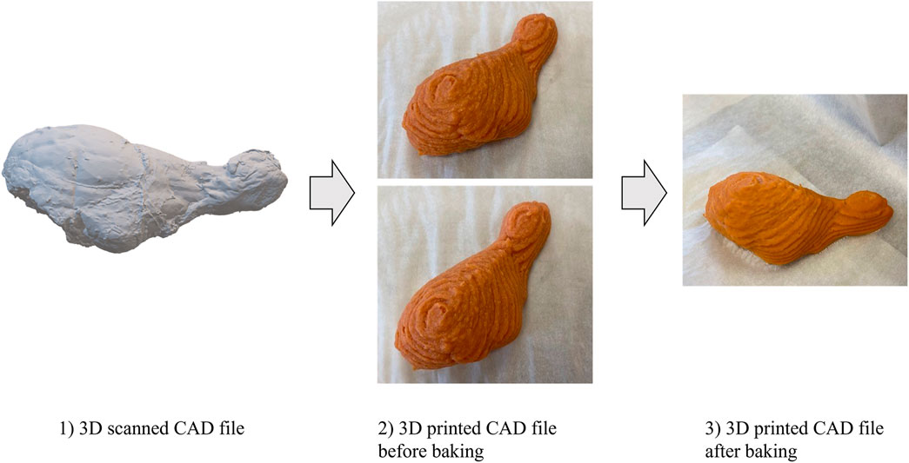
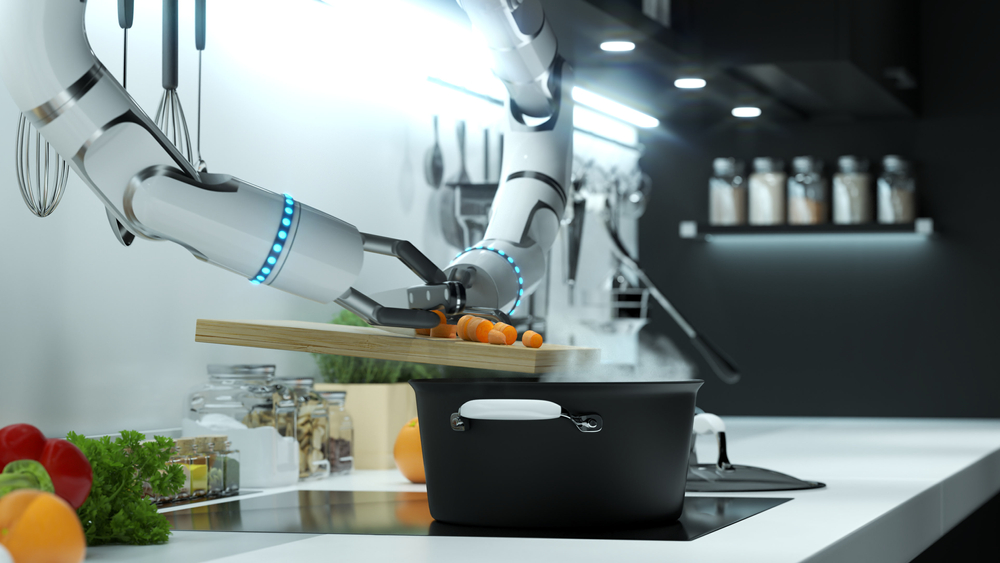
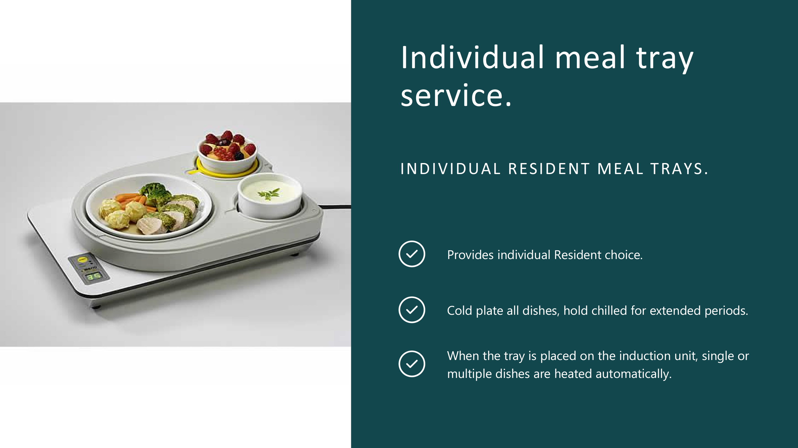
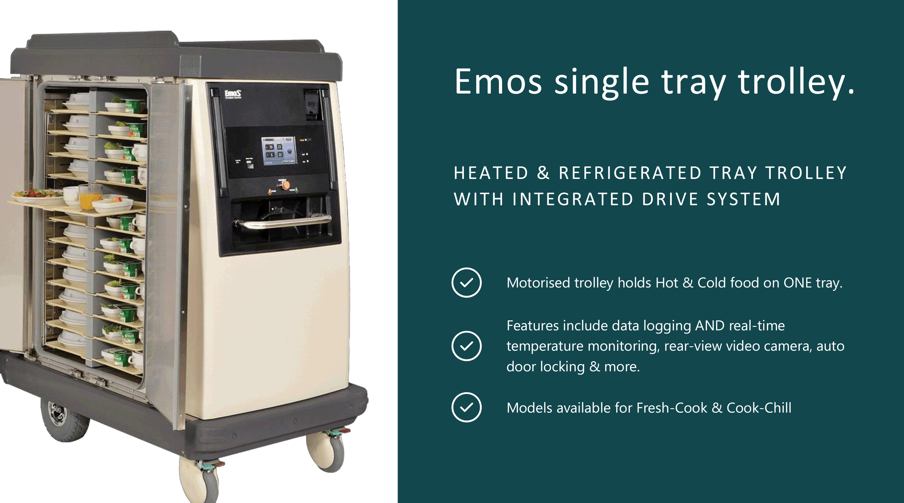
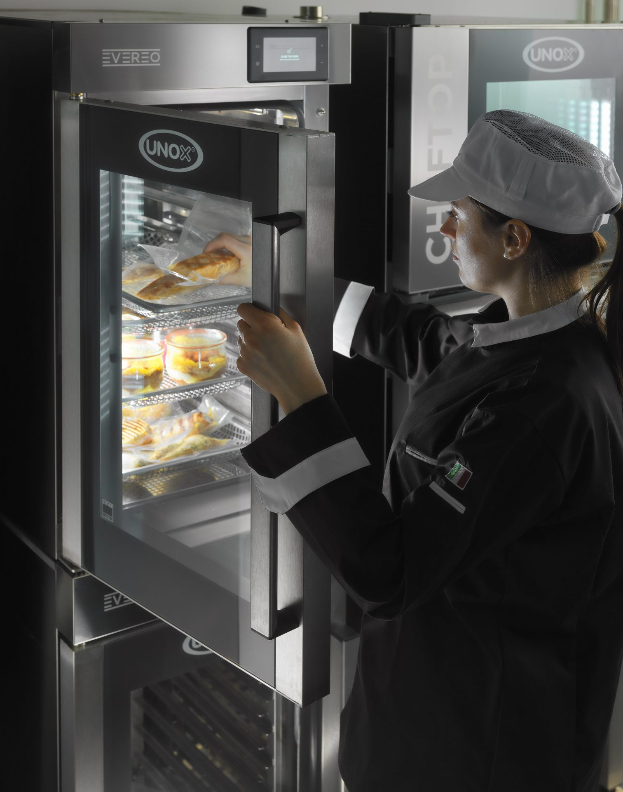

Over the past decade, technology has revolutionised the way healthcare and human services are delivered.

Particularly since the COVID-19 pandemic, it's now unthinkable to live in a world without telehealth and web-enabled tools to manage everything from appointment scheduling to getting test results and ordering meals.

Unfortunately, compared to hospitals and outpatient services, the uptake of technology in aged care hasn't progressed quite so seamlessly.

In fact, a recent Australian review of technology in aged care concluded that "The existing technology does not meet the needs of older people, aged care personnel and the system in general."

Does that mean technology doesn't have a place in aged care homes and services? Absolutely not. There are countless examples of technology bringing about tangible improvements in the quality of care delivered in aged care facilities.

However, it highlights that especially in areas that benefit from a 'human touch', like food services, it's not enough to simply take new technological developments from other settings (like hospitals or restaurants) and presume they'll automatically be beneficial for aged care residents.

To understand how technology could be used to improve food services in aged care homes, we need to review new innovations through an aged care lens.

In this article we briefly touch on the current state of affairs with food services in aged care homes in Australia. Then we detail 8 key technology innovations for aged care kitchens that have the potential to improve quality of care and efficiency in service delivery.

## Expanding choice and quality

Food and nutrition came under the spotlight during the 2021 Royal Commission into Aged Care Quality and Safety, being identified as an area requiring priority attention.

The Australian Government subsequently announced several measures aimed at improving food and nutrition in aged care, many of which have recently begun (the new Food, Nutrition and Dining Advisory Support Unit) or are soon to commence (a new food and nutrition standard in the Aged Care Quality Standards).

Alongside these policy measures, a discussion paper on residential aged care food services was also released. After presenting an overview of the literature on improving nutrition and the dining experience for aged care residents, the paper presents 10 points of focus for future activity in the sector:

1. Improved meal choice and quality
2. Alternative food service delivery models and innovation
3. Evidence-based menu planning and assessment
4. Routine malnutrition screening
5. Support for independent food and drink consumption
6. Food delivery, timing and temperature management
7. Ongoing quality review and consumer feedback mechanisms
8. 24-hour dining and access to fluids
9. Dining room ambience
10. Increased emphasis on oral health

In our opinion, to be suitable for use in aged care homes, any technological innovation must help move forward at least one of these focus areas.

For example, 3D food printing technology (discussed shortly) could facilitate point 1: Improved meal choice and quality. Advanced aged care catering software like Embrayse has been specifically designed to advance most of these focus areas, in particular improved meal choices and quality, supporting evidence-based menu planning and assessment, and most importantly, ongoing quality review and consumer feedback mechanisms.

## Food services technologies to keep an eye on

After that lengthy introduction, here are the 8 technology innovations in aged care kitchens that we feel have the greatest potential to benefit aged care residents and the industry as a whole.

### 1. 3D food printing

Perhaps the most futuristic technology we will discuss, 3D food printing, is far closer to being a reality than you might expect.

The main application for 3D food printing is for people with swallowing disorders, like dysphagia.

Dysphagia affects between 40% and 68% of adults living in aged care homes in Australia. To avoid choking and pneumonia, people with swallowing disorders are generally fed texture-modified food molds, known as timbales. While these reduce the risk of choking, the difference in appearance to traditional foods can contribute to appetite reduction, malnutrition and frailty in people with dysphagia.

3D scanning and food printing offers a potential solution to this challenge.

By scanning a food item (such as a chicken drumstick), a 3D food printer can then be used to produce a more realistic representation than a timbale, while still retaining a safe texture for people with dysphagia.

Believe it or not, trials of food printing in aged care homes are currently underway in Australia, in partnership with the University of Technology Sydney. Edith Cowan University is also working to bring the technology to market for people of all ages.

**Priority areas addressed:** Improved meal choice and quality; Alternative food service delivery models and innovation.

### 2. Nutritionally enhanced foods

One of the big benefits of 3D printed foods is the capability to selectively nutritionally enhance food for individual residents. This could be in the form of increasing protein content, adding select micronutrients or providing additional fibre.

However, there's no need to wait until 3D food printing goes mainstream to adopt this strategy.

Protein supplementation in foods like ice cream, smoothies and desserts is a viable and achievable option right now. Providers can choose from a variety of pre-fortified ready-made options or adjust existing recipes to include protein powder.

A similar approach could be taken with micronutrients and 'superfoods' supplements. However, this would likely require individual medical assessment and consultation with resident and/or family guardians before progressing.

Where there is no immediately indicated medical need, nutritionally enhanced foods may be provided as an additional food services strategy to make it economically viable.

**Priority areas addressed:** Improved meal choice and quality; Evidence-based menu planning and assessment.

### 3. Cooking robots

While they haven't yet reached aged care, cooking robots are starting to revolutionise the restaurant industry.

From smart appliances to robot arms to fully robotic kitchens, it is now possible to purchase cooking robots to help with many of the repetitive tasks undertaken in a large kitchen (such as chopping, stirring and turning). They also can play a role in quality control, similar to the DOM Pizza Checker recently implemented in Australia.

For aged care, cooking robots may help ease the staffing issues and financial pressures around food services. However, the high capital costs are likely to make this unfeasible for many providers.

Furthermore, benefits to residents would likely rely on cooking robots not simply being used as a cost-cutting exercise, with efficiencies being redistributed to other areas of food service (like enhancing dining experience). Regardless, as the technology becomes cheaper and more accessible, investments in cooking robots may prove rewarding.

**Priority areas addressed:** Alternative food service delivery models and innovation.

### 4. New cooking models

Some of the challenges around meal quality in aged care settings come from applying conventional cooking models to what are essentially large scale catering operations.

For example, while a family-style roast beef is a wonderful way to provide a familiar, appealing and homely meal for aged care residents, the end product doesn't always match expectations. Unfortunately, cooking in large batches and then keeping meat at food safe temperatures from kitchen to plate often results in dry, overcooked meat that's both unappealing and difficult to chew and swallow.

Adopting hybrid food models, such as a mixed cook-chill / fresh-cook model, offers increasing flexibility for providers to expand menu options.

A prime example is buying sous vide cook-chilled meats. These pre-cooked and then chilled meats have great taste and texture and an extended shelf life, and can be flash grilled before serving or added to stews and stir fries, speeding up the process of cooking on premise before serving without compromising food safety or quality. Other cook-chilled products such as pastas and stews can be offered as alternative menu options for residents, with exact portions regenerated and served based on resident orders to ensure minimum food waste and maximum efficiency.

**Priority areas addressed:** Improved meal choice and quality; Food delivery, timing and temperature management.

### 5. Service robots

Service robots are an example of a foodservice technology that is generally suitable for food service industries, but not so much for aged care.

Anyone who has taken young children to a restaurant with serving robots likely appreciated the squeals of delight and fascination as the robots did their thing. Yet, service robots would be unlikely to get a similar reception in an aged care setting (plus they would reduce the important human-to-human element of the dining experience).

However, in the interests of providing a balanced view of this technology, Sunshine Coast University Hospital has reported success with a 'hybrid model,' where robots do much of the "heavy lifting" involved in transporting meals. This has the benefit of freeing up staff time to spend more time delivering meals with care and attention at the point of service.

Like with cooking robots, the efficiencies from service robots could be used by larger providers to focus on enhancing dining experiences and other aspects of food service.

**Priority areas addressed:** Food delivery, timing and temperature management; 24-hour dining and access to fluids.

### 6. Hot and cold food transport units

Anyone who has worked in an aged care home will be familiar with complaints that food is unappetising due to food transport issues.

A variety of issues can occur while meals are making their way from kitchen to plate to resident. The most common culprits caused by traditional transportation methods are:

- Hot meals being lukewarm or cold
- Warm salads and desserts (from being stored next to hot food)
- Gravies, sauces and stews/casseroles being congealed upon arrival

This is one area where innovation in another industry, aviation, does have applicability to aged care services.

For some time now, certain airlines have utilised meal trays that can be stored chilled, then selectively heat individual components to a desired temperature.

Or, a slightly lower tech solution: a heated and refrigerated single tray trolley.

**Priority areas addressed:** Improved meal choice and quality; Food delivery, timing and temperature management.

### 7. Point of service serving options

Not all food service innovations in aged care need to utilise new technology. Sometimes, using existing tools in a different manner can greatly enhance the dining experience.

Two relatively easy-to-implement and low cost examples of this are 'family meal' style serving options (buffet or banquet) and 'popup' or temporary food serveries.

A family meal model can be implemented by utilising technology like bain maries and chillers in dining areas to enable aged care residents to choose and serve their own food (with assistance from staff if required). This has been shown to improve energy intake among residents at risk of malnutrition.

A popup food servery is essentially a small kitchenette, where parts of a meal can be prepared and served to enhance the dining experience. An example would be baking bread with automated bread makers and cooking soup/stew in a crockpot.

The aroma in the dining area helps to build appetite and anticipation for the meal and provide a more homely environment. To take it up a notch, fresh herbs planted in the dining area or even a hydroponic setup for tomatoes, herbs and lettuce can create even more connection and engagement with the meal.

**Priority areas addressed:** Improved meal choice and quality; Alternative food service delivery models and innovation; Support for independent food and drink consumption; Food delivery, timing and temperature management.

### 8. Hot fridge food preservers

While hot and cold food transport units can overcome some of the temperature issues regarding food transport, they don't provide much additional flexibility with mealtimes.

Requiring all residents in an aged care home to eat lunch and dinner at the same time minimises consumer choice and independence with mealtimes. It can also increase food wastage, as all uneaten food must be discarded after a set time to comply with food safe guidelines.

Hot fridge food preservers, like the Evereo products, allow cooked food to be stored at service temperature for extended periods of time. Due to accurate temperature and atmospheric control, even uncovered food can be hygienically stored for up to eight hours while preserving its original taste and texture.

This enables providers to offer more flexibility with mealtimes where it is requested or required by residents.

**Priority areas addressed:** Improved meal choice and quality; Alternative food service delivery models and innovation; Food delivery, timing and temperature management.

## The importance of context

If there is one key takeaway from this exploration of technology to improve food services in aged care, it is that context matters, a lot.

Food (and health) technology will continue advancing at a rapid pace. So much so that dining at a restaurant, cooking dinner at home, receiving a meal in a hospital and eating on a plane will likely look very different 10 years on than they do now.

While there will undoubtedly be innovations from these areas that have great carryover to aged care homes, many won't.

When it comes to food technology, the role of leaders in aged care will always be to evaluate the options on offer and decide which could be beneficial in the specific aged care context.

Running parallel to all current and future food technology innovations is catering software.

Regardless of how food is cooked and delivered, providers will always need to capture resident dietary profiles, plan menus, allow staff and residents to order, collect feedback and more.
