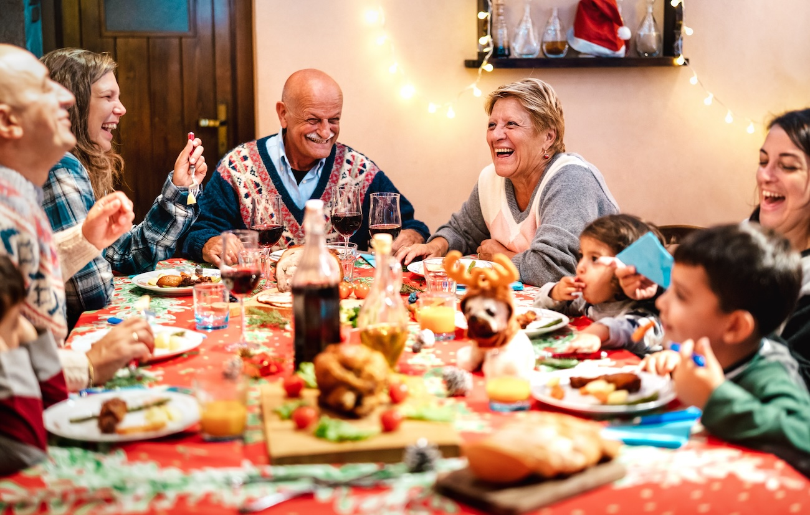
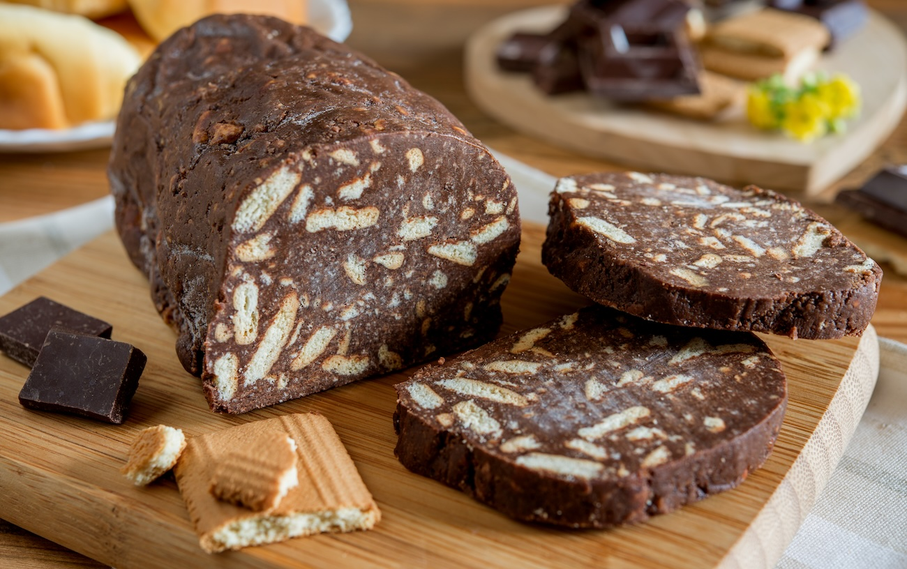

The overwhelming majority of aged care homes in Australia celebrate Christmas, and this is a great thing.

Hosting Christmas luncheons for families and serving festive menu items throughout December (like Christmas puddings, eggnog, gingerbread and ham) are examples of food-related activities that can bring a huge amount of joy to residents.

When combined with things like Christmas carols, decorations and other celebratory events, many residents will feel like they get a full 'Christmas experience.'

However, for some, these activities don't reflect the lived experience of how they used to celebrate Christmas with their families.

For these residents, Christmas celebrations can instead lead to some sad reflections on what they miss about this special time. Such a feeling is often summed up in a statement along the lines of, "This isn't Christmas to me."

With the festive season about to get into full swing, now is a great time to look at some practical ways aged care homes can engage with residents and families around Christmas-related food and dining experiences.

## The Australian context

Australia is a melting pot of different cultures and backgrounds. So it's not surprising that our aged care system reflects this diversity.

According to data from the Australian Institute of Health and Welfare:

- 33% of people using aged care services were born overseas.
- 19.6% of residents in aged care homes were born in a non-English speaking country.
- 12.3% of residents were born in an English speaking country other than Australia.

This means that on average, residential aged care homes could count on around one third of their residents potentially celebrating Christmas in a different way (or not at all).

Many overseas-born aged care residents may enjoy and have even adopted Australian customs around Christmas. However, considering how intertwined food-related cultural practices are with feelings of connection and identity, the importance of inclusive meal practices during the festive season becomes apparent.

## Food, connection and identity

Across all cultures, food is used as an important source of connection with friends, loved ones, religious and cultural practices and the wider community.

While nutrition is undoubtedly a primary concern when it comes to meals in aged care settings, food, cooking and dining experiences are also strongly linked to social well-being.

Especially during significant events (such as those occurring toward the end of the year), food plays a central role in bringing people together. It also provides a sense of meaning, purpose and well-being for those involved in its preparation and hosting.

A few examples originating outside of Australia include:

- **Thanksgiving (late November).** Modelled after a "harvest feast" to celebrate blessings throughout the year. Centred around sharing a meal between family and friends.
- **Hanukkah (mid-December).** An 8-day Jewish festival marking the overthrow of Greek occupiers by Jewish freedom fighters. Oily foods (such as traditional donuts and pancakes) and dairy are an important part of the event.
- **Noche Buena (Christmas Eve).** Many Latino and Filipino households throughout the world host a late dinner on 24 December, which can go throughout the night over to Christmas Day. Foods served vary according to cultural background, but tend to be large cuts of pork to feed a lot of people.

## The importance of the individual experience

While the events above focus largely on collective experiences, it's essential to remember the unique importance the celebration might have for the individual.

For example, an American resident may have taken particular pride in hosting Thanksgiving each year. A Jewish resident could derive a significant feeling of fulfilment from having prepared a specific signature dish each Hanukkah. Or, for someone from a Filipino background, sharing dinner with family on Christmas Eve may take precedence over Christmas Day.

Even among Australian-born residents, individual experiences of Christmas can vary widely.

For some, Christmas Day is a formal occasion to have a special lunch or dinner with family. For others, a morning trip to the beach followed by a low-key barbecue and relaxing afternoon represents a day well celebrated.

Anything aged care homes can do to support residents in continuing to participate in such practices can have a significant positive impact on overall well-being.

However, the obvious question that comes up is:

**With seemingly endless ways individuals incorporate food into Christmas celebrations, how can providers be more inclusive regarding residents' individual needs?**

## The golden rule of inclusivity

One rule sits above all else when it comes to inclusivity: **Ask. Don't assume.**

Compared to taking it upon yourself to research what festive meal options residents might appreciate, asking for direct feedback has two important benefits:

1. **It identifies the practices that are most important to your residents.** For some, this could be more around dining experience and time with family than food choices. For others, having access to specific foods will be the most important component.
2. **It makes residents and families feel seen and heard.** Even if it's not possible to implement all the practices important to your residents, the simple act of asking can make them feel more valued and included during the festive season.

That being said, if your organisation simply doesn't have capacity to survey residents and family members about the festive season right now, that's ok.

An interim measure would be to look at the demographic data of your residents and plan a few culturally relevant meals and experiences for this year, while perhaps planning a brief survey to inform changes that could be made next year.

To get you started, here are some ideas for Christmas menu items based on some of the largest populations of overseas-born Australians.

### England

While there are a lot of similarities between a traditional English and Australian Christmas dinner, two things you'll often see on an English table (but rarely at an Aussie Christmas) are bread sauce and Yorkshire puddings.

Another traditional fare is sausage rolls on Boxing Day, which reflects pre-prepared light meals in olden times when this was one of the only days when upper-class families had to survive on leftovers.

### Italy

Some of the seafood-heavy traditional Italian Christmas dishes might be difficult to serve in aged care homes. However, there are some pasta options that are relatively easy to implement and are a must for any Italian Christmas feast.

Stuffed pasta (like ravioli or tortellini) features in many Italian Christmas meals. Another option is lasagne.

Both these dishes are very versatile, so they can be served according to the availability of ingredients and capacity of the kitchen in any aged care home.

### Greece

When it comes to Greek Christmas foods, it's hard to go past desserts.

Two choices commonly served during holidays and over Christmas are Chocolate Salami (Mosaiko) and Greek Walnut Cake (Karydopita).

Being a no-bake option, Chocolate Salami lends itself well to residents getting involved in the cooking and serving. Greek Walnut Cake can be prepared at scale if needed.

### South Africa

As another country in the Southern hemisphere, South Africa shares many traditions with Australia of Christmas barbecues and outdoor games.

Dishes such as roasted meats and vegetables, fruit mince pies and puddings are popular South African Christmas foods, along with sides such as yellow rice and raisins, sambals and potato bake.

## Don't forget the fun

There has been a lot of serious reform around food and nutrition in aged care homes in recent years. However, when it comes to the festive season, food is only part of the equation.

When implementing inclusive practices during holiday periods, meal choices and dining experiences are essentially chosen to make residents feel connected, recognised and comfortable.

Yet it's important to remember that the reason fond memories exist around these holiday meals is as much to do with the social environment at the time as it is the actual food being served.

So while efforts should be made to accommodate the specific food preferences of residents, the overall festive feeling and atmosphere of the dining experience is also an essential ingredient.

If you want help to seamlessly gather feedback from your residents and implement menu changes with ease, Embrayse can help.
